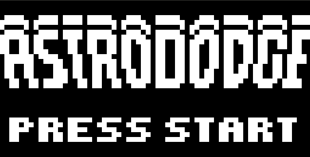
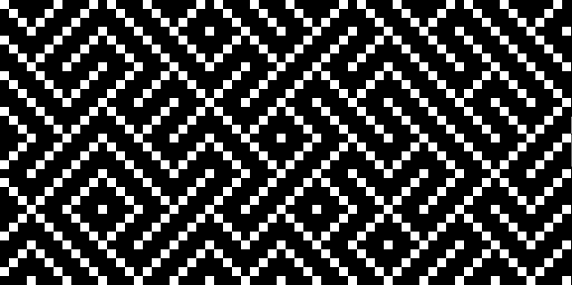

# Rusty Chip, A Rusty Emulator!

## What is Rusty Chip?
Rusty Chip is a chip8 emulator. It features 64x32 graphics, sound and keyboard controls.

The emulator was implemented in Rust using [this](http://devernay.free.fr/hacks/chip8/C8TECH10.HTM#2nnn) technical reference.

## Screenshots

### LUNAR LANDER

### ASTRO DODGE

### BRIX

### MAZE

### PUZZLE

## Usage

To play a game using rusty-chip run `cargo run <rom name>`

For example: `cargo run roms/PONG` 

